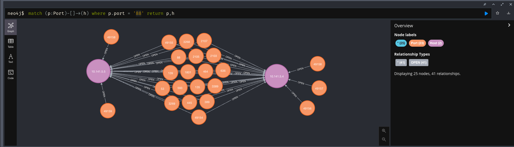

# nmap-to-neo4j
Simple python script for importing Nmap results to a Neo4j Graph Database.




## Usage
First, run a nmap scan in your network. Save the results with the XML flag (`-oX`).
```
nmap -sV 192.168.1.1/24 -oX nmap_results
```

Now start your Neo4j instance and run the `nmap-to-neo4j.py` script.
```
python3 nmap-to-neo4j.py -p neo4j_password -f nmap_results --attacking-ip 10.0.0.2
```


## Installation Prerequisites 
1. [Neo4j Community Edition](https://neo4j.com/download-center/) (tested on 5.27.0)
2. Python3
3. Python pipenv (recommended)


## Setup
```
pipenv shell
pipenv install
```


## Querying Results
Neo4j is complicated at times, but this tool is super simple. I generally recommend a few of the following queries:


#### Find and return all ports
```
match (a:Port) return a
```

#### Find and return all hosts
```
match (a:Host) return a

```
#### Find and return all hosts with open ports
```
MATCH (p:Port)-[:OPEN]->(h:Host) RETURN h
```

#### Find and return a specific host and its ports
```
MATCH (p:Port)-[:OPEN]->(h:Host) where h.host = "192.168.1.18" return p,h
```

#### Find and return specific hosts by port number
```
MATCH (p:Port)-[]->(h) WHERE p.port = '88' return p,h
```

[Here is a Cheat Sheet for Cypher you can refer to](https://neo4j.com/docs/cypher-refcard/current/) in case you want to learn more. 